# Week 14: Tech Blog

## Description

For our 14th week in our coding bootcamp, we were tasked with creating a simple blog that used Sequelize to interact with a database full of users, posts, and comments. All pages were to be rendered using handlebars. We were also to keep track of logged in users using Express Sessions, limiting what non-authenticated users could do.

First order of business in all start-from-scratch challenges is of course to get all directories and index files in place. Having some sort of initial organization to something so large and intimidating as *an entire full stack app* helps discern what the first steps should be. So second chunk of work to get done was to create a database, models for that databse, seeds for those models, and how those models relate to eachother. Simple enough, we've done that all before plenty of times. As long as you have a pretty good idea of what exact information will be needed from each model, this is all pretty low stress.

Next is where the rubber starts to hit the road, routes were established next. An actual front end wasn't really needed yet as the pages themselves are just a way to organize and serve requests. Keeping in mind what data needs to be collected and presented in varius contexts, and when it would be appropriate for users to make posts to the database was key to establishing routes that served a purpose.

After that it was time to get some front end styling and scripting done. It had been a hot minute since we've needed to do any front end JS and an even hotter minute since doing it without jQuery. I couldn't get jQuery to work in the (admitedly small) time I dedicated to linking it, so it ended up being a whole lot of *document.quereySelector('#thing')*. But it was a nice refresher nonetheless, and of course more errors appeared when trying to get a submit button to work than the entirety of debugging Sequelize and dotenv. 

Last and certainly not least was procuring authentication and adding checks to ensure only logged in users could visit certain pages and complete certain actions. Here Express Sessions turned out to be pretty *set and forget*. I was pleasantly surprised with how error-free and versitile it was. Some middleware was added as well that let all handlebar files see req.session.logged_in. This was key in dynamically rendering pages to either permit or deny a user to leave comments, register as a new user, and more. Another key value stored in the session was the logged in user's ID. This helped to make post requests as easy as could be, as anytime a new post or comment was left *req.session.user_id* could be referenced instead of having to fumble around will unecesary database queries.

It's difficult to go into detail on all the fun little tricks that were used to make the full stack development process silky smooth. While this brief description may give the impression that it was a linear process, the whole time I was bouncing back and forth between writing markdown for handlebars, editing routes to better suit the data I needed, and tweaking front end Javascript to cater to a specific need. This assignment truly does feel like the culmination of four months of learning web development, as it's the first truly full stack applicaiton that we built from the ground up.

## Installation 
 
Application is already deployed to Heroku [here](https://murmuring-mesa-66230.herokuapp.com/).

## Usage

- While some features of the app can be accessed without logging it (such as viewing singular posts and their comments) if the user wants to contribute, they will need an account.

- If you have previously used the app, log in with your credentials.

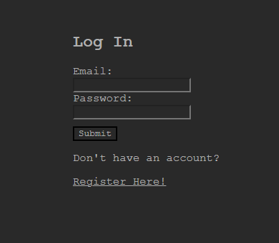

- If this is your first time using the app, then you can register a new account. Input your desired username, contact email, and password.

- Your password will be encrypted using bcrypt and stored in the database.

- We adhere to a strict *no junk mail policy*, so no confirmation email will be sent to the submitted email address. (Mostly because no confirmation or recovery functions have been implemented yet but that's for another assignment)

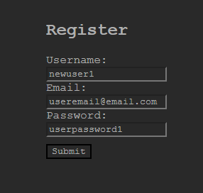

- Once you have either logged in or registered, the Log In option has been replaced with Log Out. 

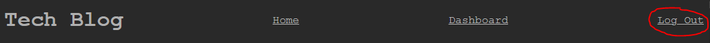

- You will now be able to make posts and leave comments. To start writing, click the New Post button.

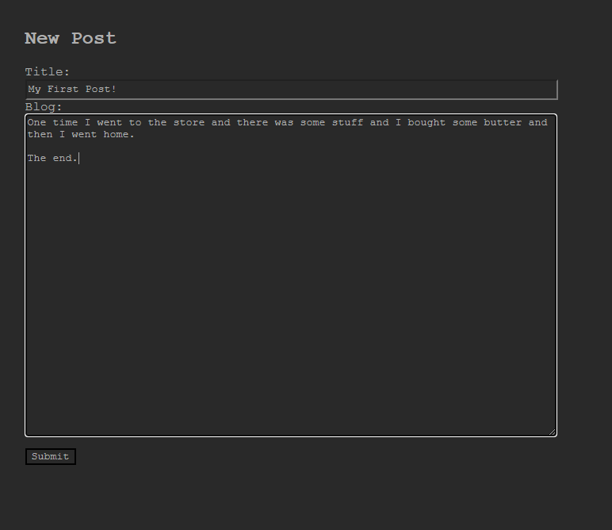

- Once you have finished, hit Submit. Your new post will be created and you will be redirected to your User Dashboard.

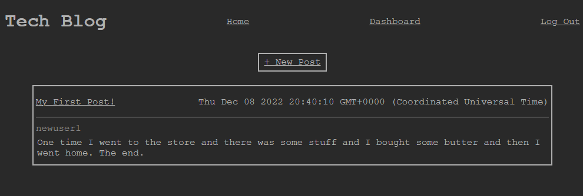

- When viewing a single post, you will be able to leave comments on another user's submissions.

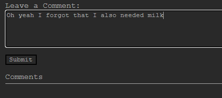

- All of a post's comments will appear in the comment section.

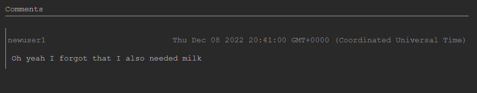

- If at any point you'd like to edit a submission you've made, navigate to the desired post via the User Dashboard. If a post belongs to you, there will be some editorial options above the post.

- When chosing to edit a post, test entry fields will appear populated with the post's content. Now you are able to edit the post.

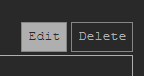

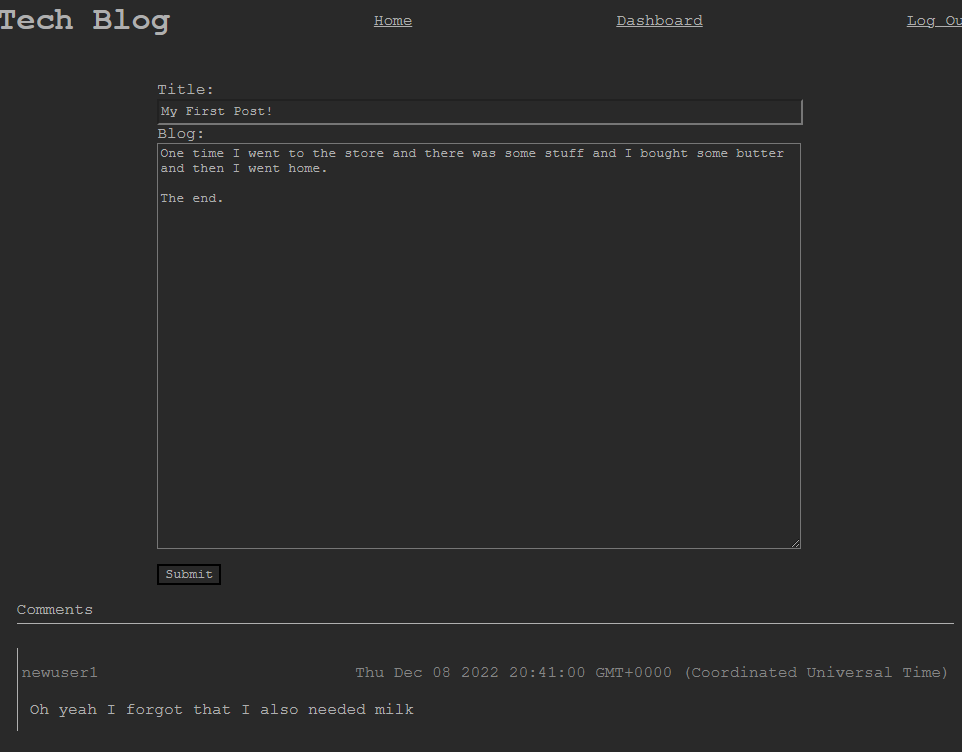

- When done, hit submit and the page will reload and the post will be updated.

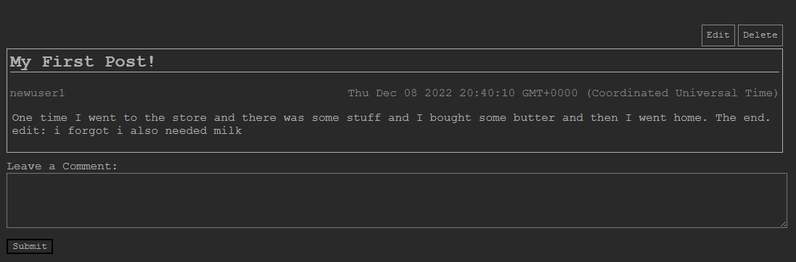

- If you'd like to delete a post outright, click on the Delete button.

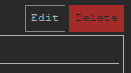

- You will be prompted to confirm this action. Upon confirmation, you will be sent back to the User Dashboard and the post will be removed.

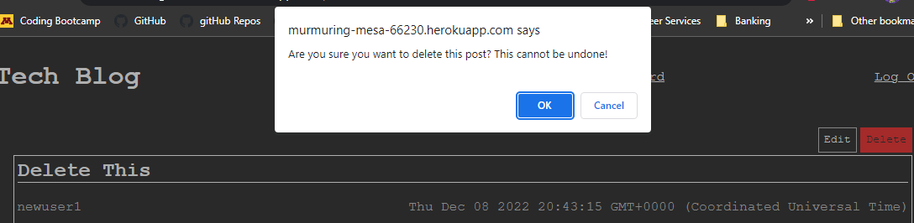

## License

Standard MIT License
App deployed using [Heroku](https://www.heroku.com)
