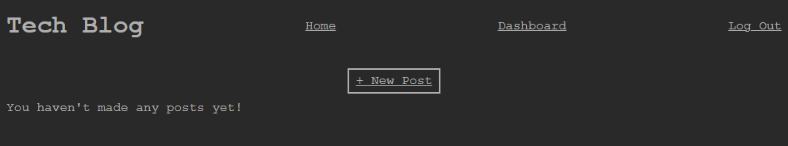

# Week 14: Tech Blog

## Description

For our 14th week in our coding bootcamp, we were tasked with

## Installation 
 
Application is already deployed to Heroku [here](https://murmuring-mesa-66230.herokuapp.com/).

## Usage

- While some features of the app can be accessed without logging it (such as viewing singular posts and their comments) if the user wants to contribute, they will need an account.

- If you have previously used the app, log in with your credentials.

- If this is your first time using the app, then you can register a new account. Input your desired username, contact email, and password.

- Your password will be encrypted using bcrypt and stored in the database.

- We adhere to a strict *no junk mail policy*, so no confirmation email will be sent to the submitted email address. (Mostly because no confirmation or recovery functions have been implemented yet but that's for another assignment)

- Once you have either logged in or registered, the Log In option has been replaced with Log Out. 

- You will now be able to make posts and leave comments. To start writing, click the New Post button.

- Once you have finished, hit Submit. Your new post will be created and you will be redirected to your User Dashboard.

- When viewing a single post, you will be able to leave comments on another user's submissions.

- All of a post's comments will appear in the comment section.

- If at any point you'd like to edit a submission you've made, navigate to the desired post via the User Dashboard. If a post belongs to you, there will be some editorial options above the post.

- When chosing to edit a post, test entry fields will appear populated with the post's content. Now you are able to edit the post.

- When done, hit submit and the page will reload and the post will be updated.

- If you'd like to delete a post outright, click on the Delete button.

- You will be prompted to confirm this action. Upon confirmation, you will be sent back to the User Dashboard and the post will be removed.

## License

Standard MIT License
App deployed using [Heroku](https://www.heroku.com)
